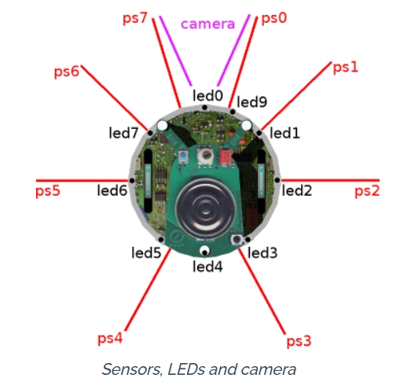

## 公式ドキュメント

https://cyberbotics.com/doc/guide/epuck?version=R2022b

## デバイス一覧
e-puckに搭載されているデバイスは、名前だけでは役割がわかりにくいものがいくつかあります。ご質問のデバイス名（リスト）が提示されていなかったため、Webotsのe-puckモデルに標準で搭載されている主要なデバイスについて、その意味と役割をまとめました。

もし、これら以外の特定の名称について知りたい場合は、続けて教えてください。

### e-puck デバイス一覧表

| デバイス名 | デバイスの種類 | 意味・役割 |
| --- | --- | --- |
| **`left wheel motor`** | Motor | **左車輪用モーター**。左側のタイヤを回転させます。 |
| **`right wheel motor`** | Motor | **右車輪用モーター**。右側のタイヤを回転させます。 |
| **`ps0` 〜 `ps7**` | DistanceSensor | **近接センサー（8個）**。赤外線で周囲の障害物との距離を測ります（0が前方、時計回りに配置）。 |
| **`ls0` 〜 `ls7**` | LightSensor | **光センサー（8個）**。周囲の光の強さを測定します。近接センサーと同じ場所に配置されています。 |
| **`gs0`, `gs1`, `gs2**` | DistanceSensor | **グラウンド（床面）センサー**。底面にあり、床の色や線を検知します（ライントレース用）。 |
| **`led0` 〜 `led9**` | LED | **LEDライト**。本体の周りや上部にあるLEDを点灯・消灯させます。 |
| **`camera`** | Camera | **カメラ**。前方の画像を取得します。標準解像度は低め（52x52など）に設定されています。 |
| **`accelerometer`** | Accelerometer | **加速度計**。3軸の加速度（重力や衝撃）を測定し、ロボットの傾きなどを知ることができます。 |
| **`gyro`** | Gyro | **ジャイロセンサー**。ロボットの角速度（回転する速さ）を測定します。 |
| **`left wheel sensor`** | PositionSensor | **左車輪エンコーダ**。左タイヤがどれくらい回転したか（角度）を測定します。 |
| **`right wheel sensor`** | PositionSensor | **右車輪エンコーダ**。右タイヤがどれくらい回転したか（角度）を測定します。 |
| **`microphone`** | Microphone | **マイク**。周囲の音を検知します（Webotsのスピーカーデバイスと組み合わせて使用）。 |

### デバイス名の規則

* **ps** = **P**roximity **S**ensor（近接センサー）
* **ls** = **L**ight **S**ensor（光センサー）
* **gs** = **G**round **S**ensor（床面センサー）

特に `ps0` 〜 `ps7` は、ロボットの真前から時計回りに番号が振られています（`ps0`と`ps7`が前方、`ps3`と`ps4`が後方）。障害物回避プログラムを作る際は、この番号の配置を意識するのがコツです。

