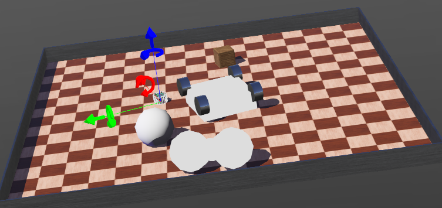

本日は、ロボット制御の練習をやる良い環境ないかと探していて見つけた仮想環境と、お試しで行ったセンサのトライアルについて説明します。

## そもそものモチベーション
強化学習の応用としてロボット制御を考えていました。
ですが、現実世界のロボットを自作する場合、お金がメチャかかるという課題がありました。
(物価高騰中の今だとピンキリですがセンサ一つ$50くらいでしょうか。)

ですので、PCで動作させる仮想環境はないかと探していました。

## Webotsとは

Webots（ウェボッツ）は、世界中の研究者や教育機関で最も広く使われている**オープンソースの3次元ロボットシミュレーター**です。

一言でいうと、「コンピューターの中に現実そっくりの物理空間を作り、ロボットの動作を安全・高速にテストできるソフト」です。

### Webotsの主な特徴

Webotsがなぜ選ばれるのか、その魅力を3つのポイントでまとめました。

- **物理エンジンの搭載**: 重力、摩擦、空気抵抗、物体の硬さなどがシミュレートされています。ロボットが壁にぶつかったり、坂道を転がったりする動きも現実的に再現されます。
- **豊富なロボットモデル**: 今回使用している **e-puck** のほか、**Boston DynamicsのSpot**、**Aibo**、ドローン、自動運転車、ヒューマノイド（NAO等）など、多種多様なモデルが標準で用意されています。
- **マルチ言語対応**: Python、C++、C、Java、MATLAB、さらにROS（Robot Operating System）との連携も可能です。

### Webotsでできること

プログラミング初心者から高度なAI研究まで、幅広い用途に使われています。

| 分野 | 具体的な内容 |
| --- | --- |
| **教育・学習** | 物理的な故障を気にせず、アルゴリズムの勉強ができる。 |
| **AI・強化学習** | 仮想空間で何万回も試行錯誤させ、ロボットに歩き方などを学習させる。 |
| **自動運転** | カメラやLiDAR（レーザーセンサー）を使って、街中を走るシミュレーションを行う。 |
| **群ロボット** | 数十台、数百台のロボットを同時に動かし、集団行動の実験をする。 |

### 仕組みのイメージ：Scene Tree と Controller

Webotsを理解する上で重要なのが、以下の2つの要素です。

__1. Scene Tree（シーン・ツリー）__

シミュレーションの世界にある「物体」のリストです。

* ロボットの形、センサーの種類、ライトの明るさ、床の摩擦係数などを設定します。
* いわば、 **「ロボットの体（ハードウェア）」** を作る場所です。

__2. Controller（コントローラー）__

あなたがPythonなどで書いているプログラムのことです。

* センサーの値を読み取り、モーターに速度を指令します。
* いわば、**「ロボットの脳（ソフトウェア）」**を作る場所です。

### webotsが選ばれる理由

現実のロボット（実機）だけで開発しようとすると、以下のような問題が発生します。

* バッテリーがすぐに切れる。
* プログラムのミスで壁に激突し、高価なロボットが壊れる。
* 実機の準備や場所の確保が大変。

Webotsを使えば、 **「何度失敗しても壊れず」「ボタン一つでリセットでき」「現実よりも高速にシミュレーションを回す」** ことができるため、開発効率が劇的に上がります。

### 使えるプログラミング言語

Webotsは非常に柔軟なシミュレーターで、初心者からプロの研究者まで対応できるように、複数のプログラミング言語をサポートしています。

主に以下の言語を使って、ロボットの「脳」となるコントローラーを記述できます。

__1. 公式にサポートされている主要言語__

Webotsをインストールした直後から、標準的な設定で使用できる言語です。

| 言語 | 特徴 | おすすめの用途 |
| --- | --- | --- |
| **Python** | 最も人気があります。記述が簡単で、AIや画像処理のライブラリ（OpenCV, PyTorch等）が豊富です。 | 初心者、AI研究、プロトタイプ開発 |
| **C++** | 実行速度が非常に高速です。複雑な計算や、リアルタイム性が求められる制御に向いています。 | 高度な物理計算、製品開発 |
| **C** | マイコンに近い低レイヤーな記述が可能です。実機の組み込み開発を意識した学習に適しています。 | 組み込みエンジニアの学習 |
| **Java** | オブジェクト指向を活かした大規模なシステム開発に向いています。 | 教育機関でのオブジェクト指向学習 |
| **MATLAB** | 数値解析や制御理論のシミュレーションに特化しています。専用のツールボックスが使えます。 | 制御工学の研究、複雑な数式処理 |

__2. その他の高度な連携方法__

直接的な言語以外にも、Webotsは外部のフレームワークと通信して動かすことができます。
ROSが使えるのは結構大きいですね。

* **ROS / ROS 2 (Robot Operating System)**
現代のロボット開発のデファクトスタンダードです。Webotsを「シミュレーター（体）」として使い、ROS側のノードで「知能」を動かす構成が一般的です。
* **TCP/IP 経由の外部制御**
コントローラーをWebotsのプロセスとは別に立ち上げ、ネットワーク経由でコマンドを送ることも可能です。これにより、JavaScriptなど他の言語から制御する試みも行われています。

__3. 言語の選び方の基準__

どの言語を使うべきかは、あなたの目的によって変わります。

* **「とにかく動かしてみたい」「AIを組み込みたい」**
-> **Python** が最適です。情報量も最も多く、今回のように対話形式でコードを作成するのにも向いています。
* **「将来的に実機（マイコン）にコードを移植したい」**
-> **C言語** または **C++** を選ぶと、実機のハードウェア制御に近い感覚を学べます。
* **「大学の研究で複雑な軌道計算をしたい」**
-> **MATLAB** との連携が強力な武器になります。

## 手始めの環境

いろいろ試してみました。
結果ですが、既に設定されているロボットを使った制御の練習が効率が良いです。

ということで選択したロボットは**e-puck**というロボットです。

### e-puckとは

e-puck（イープック）は、スイス連邦工科大学ローザンヌ校（EPFL）で教育・研究用に開発された、手のひらサイズの**小型自律移動ロボット**です。

ロボット工学の学習や、複数のロボットを連携させる「群ロボット（Swarm Robotics）」の研究において、世界で最も標準的に使われている機体の一つです。

__e-puckの主な特徴__

* **コンパクトな設計**: 直径約7cm、高さ約5cmと非常に小さく、机の上で手軽に実験ができます。
* **豊富なセンサー**:
* 8つの**近接・光センサー**（周囲の壁や明るさを検知）
* **カメラ**（前方の画像認識）
* **3軸加速度センサー**（傾きや衝撃を検知）
* **マイクとスピーカー**（音の検知や発信）
* **床下センサー**（ライントレースや崖検知用）

* **移動機構**: 左右2つの車輪を独立して制御する「差動二輪方式」で、その場での旋回が可能です。
* **LEDリング**: 機体の周囲に複数のLEDがあり、光らせることでロボットの状態を表現したり、他のロボットと通信したりできます。

__なぜWebotsでよく使われるのか？__

Webotsの開発元であるCyberbotics社はスイスにあり、e-puckの開発元と近いこともあって、Webots内でのe-puckのシミュレーション精度は非常に高いです。

* **実機とシミュレーションの互換性**: Webotsで作成したPythonコードを、そのまま実機のe-puckに転送して動かすことが（通信環境を整えれば）可能です。
* **教育に最適**: センサーが円周上に配置されているため、「右に壁があるから左に避ける」といった直感的なプログラミングを学ぶのに適しています。
* **拡張性**: センサーを追加した「e-puck2」などの進化版もあり、Wi-FiやBluetoothでの通信機能も備えています。

__e-puckのスペック（概要）__

| 項目 | 内容 |
| --- | --- |
| **制御CPU** | dsPIC (初期型) / STM32 (e-puck2) |
| **直径** | 約 70 mm |
| **重量** | 約 150 g |
| **最高速度** | 約 13 cm/s (6.28 rad/s) |
| **通信** | Bluetooth, 赤外線, Wi-Fi (e-puck2) |

## トライアル
ということで、トライアルを試してみました。

やった内容はe-puckに搭載されている近接センサを使った移動制御と、搭載されているカメラセンサを使って、画面に描画するです。

### 移動制御
近接センサは通常の赤外センサで、正直かなり接近しないとピクリとも反応しません。
あまり凝った制御はできないかもしれません。

今回はついている8つのセンサを使って、障害物の位置を割り出し、移動方向に障害物がないように方向を変えて前進するという制御にしました。

### カメラビジョン
カメラもかなり解像度が低いです。
カメラの設定の上で、opencvを使ってビジョンをとりあえず取得→画面に表示しました。

本試行のコードは以下に保管しています。

https://github.com/Shinichi0713/hard-ware/tree/main/robotics/servo/projects/2-tutorial/controllers/robot_cont1

実際に動作させた動画は以下のようになります。

## 総括
今回はロボットの仮想環境であるwebotsの紹介と、デモ的にお試ししたコードについて説明しました。
ロボット制御を研究するけど、ソフトウェアの方に関心があるという読者様、是非ご参考下さい。

