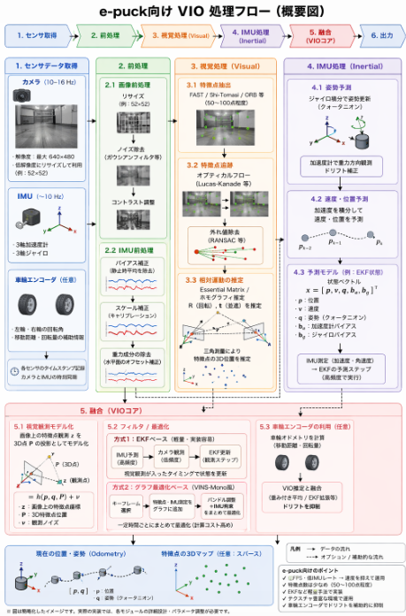

他社の技術を調べているとVIOによる自立制御なる面白い技術が見つかりました。
VIOを用いることでロボットが自分の位置を認識できるようになるようです。
結構関心領域だったこともあり、調べてみました。

## VIOとは
VIO（Visual-Inertial Odometry）は、**カメラ画像（動画）と慣性センサ（IMU）の情報を組み合わせて、ロボットやデバイスの自己位置と姿勢を推定する手法**です。

### 1. VIOの基本的な考え方

- **Visual（カメラ）**  
  連続する画像（動画）から、特徴点の移動などを追跡し、「カメラがどれだけ動いたか」を推定します。  
  例：ある特徴点がフレーム1では画面左側、フレーム2では右側に映っている → カメラが右に動いたと推定する。

- **Inertial（IMU）**  
  加速度計・ジャイロスコープなどで、**瞬間的な加速度や角速度**を測定します。  
  これにより、「どれだけ速く動いたか」「どれだけ回転したか」を高頻度で把握できます。

VIOは、この**カメラの視覚情報**と**IMUの慣性情報**を融合して、より安定かつ高精度に自己位置推定（Odometry）を行う手法です。

### 2. なぜ「画像の動画」を使うのか

- 単一画像だけでは「どれだけ動いたか」が分かりませんが、**動画（連続フレーム）** であれば、  
  - 特徴点の移動（オプティカルフロー）  
  - 三角測量（複数フレームで対応点を追跡して距離を推定）  
  などから、カメラの**移動量・回転量**を推定できます。

- ただし、カメラだけでは  
  - 急な動きやブレ  
  - テクスチャの少ない場所（白い壁など）  
  で推定が不安定になりやすいです。

そこでIMUを併用し、**高頻度で安定した動きの情報**を補うことで、  
- 動きの速い場面  
- 視覚情報が乏しい場面  
でも、自己位置推定を継続できるようにします。

### 3. VIOの代表的なアルゴリズムの流れ（概要）

1. **画像処理**  
   - 各フレームから特徴点（コーナーなど）を抽出  
   - フレーム間で対応点を追跡（特徴点マッチング）

2. **IMUからの予測**  
   - 加速度・角速度を積分して、「この短時間でどれだけ動いたはずか」という**予測姿勢**を計算

3. **融合（フィルタ or 最適化）**  
   - カメラの観測（特徴点の移動）とIMUの予測を組み合わせて、  
     最も矛盾の少ない**カメラの位置・姿勢**を推定  
   - 代表的な枠組みとして  
     - **EKF（拡張カルマンフィルタ）**系のフィルタリング手法  
     - **VINS-Mono**などの**グラフ最適化（バンドル調整＋IMU）**  
     があります。

4. **スケールの決定**  
   - カメラ単独では「移動距離の絶対的な大きさ（スケール）」が分かりにくいですが、  
     IMUの加速度情報を積分することで、**実世界のスケール**を推定できます。

### 4. VIOの特徴・メリット

- **高頻度で安定した推定**  
  IMUは数百Hz程度で計測できるため、カメラのフレームレート（30–60Hz）より細かく動きを補間できます。

- **動きの激しいシーンに強い**  
  急な回転や加速度変化があっても、IMUが補完してくれるため、カメラだけよりロバストです。

- **スケールが分かる**  
  カメラ単独のVisual Odometryでは「相対的な動き」しか分かりませんが、  
  IMUを組み合わせることで**メートル単位のスケール**が推定可能になります。

- **暗所・テクスチャ不足への対応**  
  視覚情報が乏しいときでも、IMUの情報で一時的に姿勢を維持できます。

### 5. 応用例

- **スマートフォンAR**（ARKit, ARCore など）  
- **ドローン・ロボットの自律ナビゲーション**  
- **VR/ARヘッドセットのトラッキング**  
- **自動運転・ロボットの初期位置推定（SLAMの一部として）**

など、移動体の自己位置推定が必要な多くの分野で使われています。

要するに、VIOは  
「**カメラの動画から得られる視覚情報**」と「**IMUの慣性情報**」を組み合わせて、  
**高精度かつ高頻度で自己位置・姿勢を推定する手法**です。  
特に、動きが激しい環境や視覚情報が不安定な環境で強みを発揮します。

## e-pucksのスペックとVIO
ふとVIO調べていて手元で動作させられるか気になりました。
手元に仮想環境で動作するe-pucksというロボットがあります。e-pucksのスペックは以下の表のとおりです。

| デバイス名 | デバイスの種類 | 意味・役割 |
| --- | --- | --- |
| **`left wheel motor`** | Motor | **左車輪用モーター**。左側のタイヤを回転させます。 |
| **`right wheel motor`** | Motor | **右車輪用モーター**。右側のタイヤを回転させます。 |
| **`ps0` 〜 `ps7**` | DistanceSensor | **近接センサー（8個）**。赤外線で周囲の障害物との距離を測ります（0が前方、時計回りに配置）。 |
| **`ls0` 〜 `ls7**` | LightSensor | **光センサー（8個）**。周囲の光の強さを測定します。近接センサーと同じ場所に配置されています。 |
| **`gs0`, `gs1`, `gs2**` | DistanceSensor | **グラウンド（床面）センサー**。底面にあり、床の色や線を検知します（ライントレース用）。 |
| **`led0` 〜 `led9**` | LED | **LEDライト**。本体の周りや上部にあるLEDを点灯・消灯させます。 |
| **`camera`** | Camera | **カメラ**。前方の画像を取得します。標準解像度は低め（52x52など）に設定されています。 |
| **`accelerometer`** | Accelerometer | **加速度計**。3軸の加速度（重力や衝撃）を測定し、ロボットの傾きなどを知ることができます。 |
| **`gyro`** | Gyro | **ジャイロセンサー**。ロボットの角速度（回転する速さ）を測定します。 |
| **`left wheel sensor`** | PositionSensor | **左車輪エンコーダ**。左タイヤがどれくらい回転したか（角度）を測定します。 |
| **`right wheel sensor`** | PositionSensor | **右車輪エンコーダ**。右タイヤがどれくらい回転したか（角度）を測定します。 |
| **`microphone`** | Microphone | **マイク**。周囲の音を検知します（Webotsのスピーカーデバイスと組み合わせて使用）。 |

このロボットでVIOできそうか考えてみました。

結論から言うと、**e-puckでも「精度は悪いが、VIO的な処理は原理的には可能」** です。  
ただし、実用的な精度・安定性を求めるなら、かなり厳しい条件といえます。

### 1. e-puckのセンサ構成とVIOに必要なもの

VIOに最低限必要なのは：

- **カメラ**（連続画像＝動画）
- **IMU**（加速度計＋ジャイロ）

e-puckには：

- `camera`（前方カメラ）
- `accelerometer`（3軸加速度計）
- `gyro`（ジャイロ）

が搭載されているので、**VIOを構成するためのセンサは揃っている**と言えます。

### 2. カメラ性能とVIOへの影響

検索結果によると、e-puckのカメラは：

- 解像度：**最大 640×480（VGA）**  
  [Grokipedia](https://grokipedia.com/page/e_puck_mobile_robot)
- フレームレート：**最大 16 FPS 程度**（処理負荷で 10 FPS まで落ちる場合もある）  
  [ResearchGate](https://www.researchgate.net/publication/220055326_Open-hardware_e-puck_Linux_extension_board_for_experimental_swarm_robotics_research)

一般的なVIO（例：スマホAR）では：

- カメラ：30–60 FPS、1080p 以上
- IMU：100–400 Hz

と比べると、e-puckは**フレームレートがかなり低い**です。

**影響**：

- 動きが速いと、フレーム間の対応点が追跡しにくくなり、**トラッキングが不安定**になりやすい。
- 解像度はVGAなので、特徴点抽出自体は可能ですが、**遠方の特徴点や細かいテクスチャの追跡は難しい**。

### 3. IMU性能とVIOへの影響

e-puckのIMU（加速度計・ジャイロ）は：

- データレート：**10 Hz 程度**（検索結果のIMU例に基づく概算）  
  [MDPI Sensors](https://www.mdpi.com/1424-8220/18/3/827)

一般的なVIO用IMUは 100–400 Hz なので、**10 Hz はかなり低い**です。

**影響**：

- 高頻度で姿勢を補間するのが難しく、**急な動きや振動を捉えきれない**。
- 加速度・角速度の積分誤差が大きくなり、**ドリフトが強くなりやすい**。
- カメラのフレームレート（10–16 FPS）とIMUレート（10 Hz）が近いため、**VIOの「高頻度補間」というメリットが弱くなる**。

### 4. 「精度は悪くてもVIOは可能か」の評価

__可能な点__

- センサ構成は揃っているので、**原理的にはVIOアルゴリズムを実装できる**。
- ゆっくり動く・テクスチャが豊かな環境であれば、  
  - カメラで特徴点追跡  
  - IMUで姿勢・加速度補正  
  を組み合わせて、**粗い自己位置推定**は可能です。

__難しい点・精度の問題__

- **フレームレート・IMUレートが低い**  
  → 動きが速いとトラッキングが破綻しやすい。
- **IMUのノイズ・ドリフト**  
  → 長時間走行すると位置誤差が大きく累積する。
- **カメラ視野が狭い・解像度が低め**  
  → 特徴点が少ない環境ではVIOが不安定になりやすい。

そのため、**「研究用・デモ用の簡易VIO」としては可能**ですが、  
「実用的なナビゲーションに使える精度」を期待するのは難しいです。

### 5. 実現する場合の工夫

e-puckでVIO的な処理を試すなら、以下のような工夫が考えられます。

1. **動きをゆっくりに制限**  
   - 高速回転・急加速を避け、フレーム間の対応点が追える範囲に抑える。

2. **環境を工夫**  
   - テクスチャが豊かな床・壁を用意し、特徴点を多く確保する。

3. **車輪エンコーダとの融合**  
   - `left wheel sensor` / `right wheel sensor`（エンコーダ）も使って、  
     車輪オドメトリとVIOを組み合わせることで、**ドリフトを抑える**。

4. **低解像度・低FPS向けのVIOアルゴリズム選択**  
   - 特徴点数を絞る、トラッキングの閾値を緩めるなど、  
     低スペック環境向けにパラメータ調整する。

## VIOの処理フロー

e-puckでVIOを行う場合の処理フローを、**センサ取得 → 前処理 → 特徴点追跡 → IMU予測 → 融合（位置・姿勢推定）** という流れで整理します。

### 1. 全体フロー（概要）

1. **センサデータ取得**
   - カメラ画像（動画）
   - IMU（加速度計・ジャイロ）
   - （可能なら）車輪エンコーダ

2. **前処理**
   - 画像の前処理（リサイズ、ノイズ除去など）
   - IMUデータのキャリブレーション・バイアス補正

3. **視覚処理（Visual）**
   - 特徴点抽出・追跡
   - フレーム間の対応点マッチング
   - カメラの相対運動（回転・並進）の推定

4. **IMU処理（Inertial）**
   - 加速度・角速度の積分による姿勢・速度の予測
   - ノイズ・ドリフトのモデル化

5. **融合（VIOコア）**
   - 視覚情報とIMU情報を組み合わせて、ロボットの位置・姿勢を推定
   - 必要に応じて車輪エンコーダも組み合わせる

6. **出力**
   - 現在の位置・姿勢（Odometry）
   - 必要ならマップ（特徴点の3D位置）も保持

### 2. ステップごとの詳細

__2.1 センサデータ取得__

**入力**：e-puckの各種センサ

- `camera`  
  - 解像度：VGA（640×480）程度  
  - フレームレート：最大 16 FPS 程度（処理負荷で 10 FPS 程度まで落ちる場合も）  
  - 取得タイミング：一定周期（例：10 Hz）で画像を取得

- `accelerometer`・`gyro`  
  - 3軸加速度・3軸角速度  
  - サンプリングレート：10 Hz 程度（実機に依存）  
  - 取得タイミング：カメラより高頻度が望ましいが、e-puckではカメラと同程度になる可能性あり

- （オプション）`left wheel sensor`・`right wheel sensor`  
  - 車輪の回転角度（エンコーダ）  
  - ロボットの移動距離・回転量の補助情報として利用

**処理**：

- 各センサのタイムスタンプを記録
- カメラとIMUのタイムスタンプを同期（可能な範囲で）

__2.2 前処理__

__2.2.1 画像前処理__

- 画像サイズの調整  
  - フルVGA（640×480）だと重いので、  
    **52×52 などに縮小**して処理負荷を下げる（Webotsのデフォルト設定に近い）  
- ノイズ除去（ガウシアンフィルタなど）
- 必要に応じてコントラスト強調

__2.2.2 IMU前処理__

- バイアス補正（静止時の平均値を引く）
- スケール補正（キャリブレーション係数を掛ける）
- 重力成分の除去（水平面での加速度計のオフセット）

__2.3 視覚処理（Visual Odometry部分）__

__2.3.1 特徴点抽出__

- 各フレームで特徴点を抽出  
  - 例：FASTコーナー、Shi-Tomasiコーナー、ORBなど
- e-puckの低解像度・低FPSを考慮し、**特徴点数は抑えめ（50〜100点程度）** に設定

__2.3.2 特徴点追跡__

- 前フレームと現フレームで対応点を追跡  
  - オプティカルフロー（Lucas-Kanadeなど）  
  - または特徴点マッチング（ORB記述子など）
- 外れ値除去（RANSACなど）で誤対応を排除

__2.3.3 相対運動の推定__

- 対応点のペアから、カメラの**回転 R と並進 t** を推定  
  - 基本行列（Essential Matrix）またはホモグラフィの推定
  - 三角測量で特徴点の3D位置を推定（スパースな3Dマップ）

**注意点**：

- e-puckはフレームレートが低いので、**動きが速いと対応点が追えなくなる**  
  → ロボットの速度を制限するか、IMUで補間する必要がある。

__2.4 IMU処理（Inertial部分）__

__2.4.1 姿勢予測__

- ジャイロから角速度を積分して、**姿勢（クォータニオン or オイラー角）を更新**
- 加速度計から重力方向を観測し、**姿勢のドリフトを補正**

__2.4.2 速度・位置予測__

- 加速度から速度・位置を積分  
  - ただし、e-puckのIMUはノイズが大きく、**長時間積分するとドリフトが大きい**  
  → 主に「短時間の補間」として使うのが現実的

__2.4.3 予測モデル__

- 状態ベクトル例：  
  $$
  x = [p, v, q, b_a, b_g]^T
  $$
  - $p$：位置  
  - $v$：速度  
  - $q$：姿勢（クォータニオン）  
  - $b_a$：加速度計バイアス  
  - $b_g$：ジャイロバイアス

- IMU測定値（加速度・角速度）を用いて、**予測ステップ**を実行  
  - 例：拡張カルマンフィルタ（EKF）の予測ステップ

__2.5 融合（VIOコア）__

__2.5.1 視覚観測のモデル化__

- カメラで観測された特徴点の2D位置を、  
  現在の姿勢・位置から予測される3D点の投影としてモデル化

- 観測方程式（例）：  
  $$
  z = h(p, q, P) + \nu
  $$
  - $z$：画像上の特徴点座標  
  - $P$：3D特徴点位置  
  - $\nu$：観測ノイズ

__2.5.2 フィルタ or 最適化__

**方式1：EKFベースのVIO**

- IMUで予測ステップ（高頻度）
- カメラで観測ステップ（低頻度）
- 視覚観測が入ったタイミングで、EKFの更新ステップを実行

**方式2：グラフ最適化ベース（VINS-Mono風）**

- 一定時間ごとにキーフレームを選び、  
  特徴点・IMU測定値をグラフに追加
- バンドル調整＋IMU拘束をまとめて最適化

e-puckの計算リソースを考えると、**EKFベースの軽量VIO**が現実的です。

__2.5.3 車輪エンコーダの利用（オプション）__

- `left wheel sensor`・`right wheel sensor`から、  
  車輪オドメトリ（移動距離・回転量）を計算
- VIOの位置推定と組み合わせて、**ドリフトを抑制**  
  - 例：VIOの位置推定と車輪オドメトリを重み付きで平均

### 3. e-puck向けの実装上のポイント

__3.1 性能制約への対応__

- **フレームレートが低い**  
  → ロボットの速度を制限し、フレーム間の動きを小さくする。
- **IMUレートが低い**  
  → IMUは主に姿勢推定と短時間補間に使い、  
    長時間の位置推定は視覚＋車輪オドメトリに頼る。
- **計算リソースが限られる**  
  → 特徴点数を絞り、EKFなどの軽量手法を採用。

__3.2 環境設計__

- テクスチャが豊かな床・壁を用意し、特徴点を多く確保。
- 照明を安定させ、画像の明るさ変化を抑える。

__3.3 初期化__

- 最初の数秒は静止またはゆっくり動き、  
  IMUのバイアス推定とカメラの初期特徴点抽出を行う。

### 4. まとめ：e-puck向けVIO処理フロー（簡易版）

1. **センサ取得**  
   - カメラ画像（10–16 Hz）  
   - IMU（10 Hz）  
   - 車輪エンコーダ（任意）

2. **前処理**  
   - 画像縮小・ノイズ除去  
   - IMUバイアス補正

3. **視覚処理**  
   - 特徴点抽出（50〜100点）  
   - フレーム間追跡（オプティカルフロー）  
   - 外れ値除去（RANSAC）  
   - 相対運動（R, t）の推定

4. **IMU処理**  
   - 姿勢・速度の予測（EKF予測ステップ）

5. **融合（VIO）**  
   - 視覚観測をEKFの更新ステップに反映  
   - 必要に応じて車輪オドメトリも融合

6. **出力**  
   - 現在の位置・姿勢（Odometry）  
   - 必要なら特徴点の3Dマップ（スパース）

このフローであれば、**e-puckでも「精度は低いがVIO的な処理」は実現可能**っぽいです。
処理イメージは次のようになります。

## 総括
ということで今回はVIOについて調べていきました。

- VIOとはカメラと慣性センサの情報を基に自己位置推定する手法です。
- VIOの処理は画像の対応をとりカメラ位置とIMU情報を融合して自己位置の推測を行う手法です。

因みにロボットの自律歩行における、この後続処理ですが。

VIOで現在の位置・姿勢を推定 → 目標との差を計算 → モータを制御して差を減らす

ということで実現されているとのことです。
