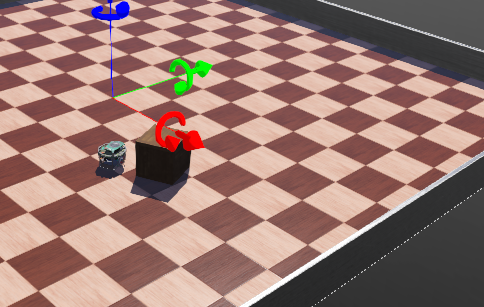
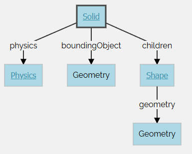
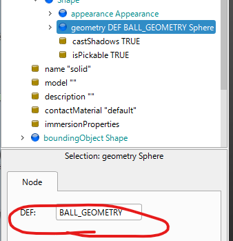
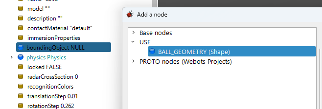
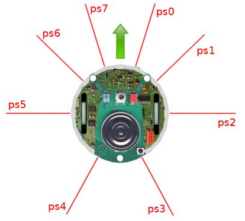
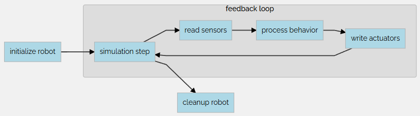
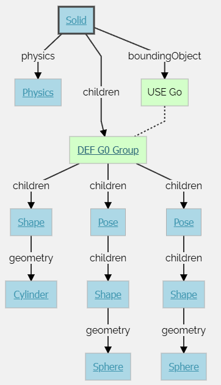
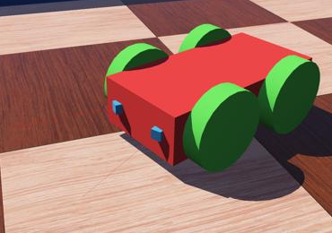
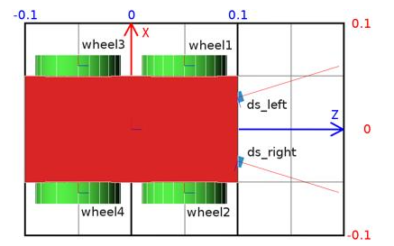

## 目的

この最初のチュートリアルの目的は、Webotsのユーザーインターフェースと基本的な概念に慣れることです。あなたは、シンプルな環境を含む初めてのシミュレーションを作成します。具体的には、床と壁のあるアリーナ、いくつかの箱、e-puckロボット、そしてそのロボットを動かすコントローラープログラムが含まれます。

## アリーナ改造

その `translation`（位置）を、`0 0 0.3`の代わりに `0 0 0.05`に変更します。もしくは、3Dビューに表示される青い矢印を使って、その `translation.z`フィールドを調整することもできます。

次に、**[Shift]**キーを押しながらマウスで3Dビュー内の箱をドラッグし、アリーナのどこかの隅に移動させます。

箱を選択し、`Ctrl-C`、`Ctrl-V`（Windows、Linux）または `⌘ command-C`、`⌘ command-V`（macOS）を押してコピー＆ペーストします。新しくできた箱を**[Shift]**キーを押しながらドラッグして、別の場所に移動させます。この方法で、3つ目の箱も作成します。

箱を移動させて、アリーナの中心に箱がないようにします。青い回転矢印を使って、箱を垂直軸に沿って回転させることもできます。これは、**[Shift]**キーを押しながらマウスの右ボタンをドラッグすることでも可能です。または、シーンツリーの `WoodenBox`ノードの `rotation`フィールドの角度を変更することもできます。

結果に満足したら、保存ボタンを使ってワールドを保存します。

## E-Puck登場

このロボには8つの距離センサがある。

このチュートリアルではホイールの制御のみを実行する。



# コントローラ

シンプルコントローラを使って、前方に進むように制御する。

ロボットの制御を行うのがコントローラ。

プログラム言語：C, C++, Java, Python, MATLAB, etc. C, C++

> The `controller` field of a `Robot` node specifies which controller is currently associated to the robot.

コントローラは使い分けが花王みたいです。

→動作しました！

### Modifying the Floor

消して追加です

### The Solid Node

solidノードは、剛体。変形一切しない。

剛体とは、外部から加えられる力にかかわらず、その内部のどの2点間の距離も時間とともに一定に保たれる物体のことです。例えば、テーブル、ロボットの指の関節骨（指骨）、車輪などは剛体です。** **

一方、軟体や関節のある物体は剛体ではありません。例えば、ロープ、タイヤ、スポンジ、多関節ロボットアームなどは剛体ではありません。ただし、関節のある物体は、複数の剛体で構成されていると見なすことができます

シミュレーションを設計する際、さまざまな実体を別個の剛体に分割することが重要なステップとなります。

剛体は以下のような属性によって定義される。



## ボールをつくる

Hands-on #4: シーンツリービューで、最後のノードを選択し、「追加」ボタンを押します。ダイアログボックスで「Bases nodes」セクションを開き、「Solid」ノードを選択します。** **

シーンツリービューで、Solidノードを展開し、その `children` フィールドを選択します。 **「追加」ボタンを使用して** 、`Shape`ノードを追加します。** **

`Shape`ノードの `appearance` フィールドを選択し、**「追加」ボタンを使用して** `PBRAppearance`ノードを追加します。** **

新しく作成された `Shape`ノードの `geometry` フィールドとして `Sphere`ノードを追加します。** **

`PBRAppearance`ノードを展開し、`metalness`フィールドを0に、`roughness`フィールドを1に変更します。** **

`Solid`ノードの `boundingObject` フィールドにもう一つ `Sphere`ノードを追加します。** **

最後に、`Solid`ノードの `physics` フィールドに `Physics`ノードを追加します。** **

`Solid`ノードの `translation` フィールドを修正して、ボールをロボットの前に配置します（例：`{0.2, 0, 0.2}`）。** **

シミュレーションを保存します。** **

# DEF-USE

DEF-USEメカニズムは、ノードを1か所で定義し、その定義をシーンツリーの別の場所で再利用できるようにする仕組みです。これは、ワールドファイル内で同一のノードが重複するのを避けるのに役立ちます。さらに、複数のオブジェクトを同時に修正することも可能になります。** **

仕組みは以下の通りです。** **

1. **まず、DEF文字列でノードにラベルを付けます。**
2. **次に、このノードのコピーをUSEキーワードを使って他の場所で再利用できます。**
3. **編集できるのはDEFノードのフィールドのみで、USEノードのフィールドはDEFノードから継承されるため変更できません。**
4. **この仕組みはワールドファイル内のノードの順序に依存します。DEFノードは、対応するUSEノードよりも前に定義される必要があります。**

以前にボールを定義するために使用した2つのSphereノードの定義は冗長です。DEF-USEメカニズムを使用し、この2つのSphereノードを1つに統合します。** **





壁の追加

あなたの進捗を確認するため、環境を囲む4つの壁をご自身で実装してください。壁は環境に対して静的に定義する必要があります。

静的と動的の違いを理解するために、地面の上に定義されたオブジェクト（ボール）を例に挙げましょう。`Physics`ノードが `NULL`の場合、シミュレーション中は空中に静止したままになります（ **静的なケース** ）。`physics`フィールドに `Physics`ノードが含まれている場合、重力の影響で落下します（ **動的なケース** ）。** **

可能な限り、`Geometry`レベルではなく `Shape`レベルでDEF-USEメカニズムを使用してください。実際、`Solid`ノードの `boundingObject`フィールドに中間的な `Shape`ノードを追加する方がより便利です。壁を実装するのに最適な `Geometry`プリミティブは `Box`ノードです。すべての壁に対して定義する必要がある `Shape`は1つだけで済みます。

期待される結果はこの図に示されています。

## Appearance

シミュレーションの見てくれを編集する。

### ライト

３パターン。

DirectionalLight: 無限遠光

PointLight: 点光源

SpotLight: 拡散ライト

## モータとコントローラ

ロボットコントローラについて学習する。

物体をよける簡単なコントローラを設計する。

webotsのプログラミングの基本について学習する。

シーンツリーとコントローラAPIについて理解することとなる。

ロボットの初期化を行い、センサー値を取得し、ロボットのアルゴリズムと結びつける方法について学ぶ。

### e-puck モデル

コントローラプログラミングはe-puckに関連づいた情報を必要とする。

衝突回避のアルゴリズムを作るには、センサ値を読む必要がある。

周囲の距離センサを取得することが可能。

**距離センサー**によって返される値は、距離に対して区分的に線形なスケールで、0から4096の間に収まるように変換されます [1]。4096は大量の光が測定されていること（障害物が近いこと）を意味し、0は光が測定されていないこと（障害物がないこと）を意味します [1]。

**コントローラAPI**は、ロボットのシミュレートされたセンサーやアクチュエーターにアクセスするためのプログラミングインターフェースです [1]。たとえば、`webots/distance_sensor.h`ファイルを含めることで、`wb_distance_sensor_*`関数を使用できるようになり、これらの関数を使って `DistanceSensor`ノードの値を問い合わせることができます [1]。API関数のドキュメントは、各ノードの説明とともに、リファレンスマニュアルで参照できます [1]。





### プログラムコントロータ

作りたい衝突回避のふるまいについて。

作りたいのは簡単な衝突回避を行うコントロールをしたい。

実現するにはFBループをUMLにより書かれたように実現する。

**Hands on #2** : At the beginning of the controller file, add the include directives corresponding to the [Robot](https://cyberbotics.com/doc/reference/robot), the [DistanceSensor](https://cyberbotics.com/doc/reference/distancesensor) and the [Motor](https://cyberbotics.com/doc/reference/motor) nodes in order to be able to use the corresponding API:

```cpp
#include <webots/robot.h>
#include <webots/distance_sensor.h>
#include <webots/motor.h>
```

## 複合ソリッドと物理特性

このチュートリアルでは物理シミュレーションのより詳細化を図る。

### 復号ソリッド

ソリッドノードはより複雑。いくつかのShapeノードで構築されることになる。

Group

直接生成されたノード。

Groupノードにはchildrenノードは、new transformを持たない。

Poseノードと同等。

```
Group {
  MFNode children [ ]    # {node, PROTO}
}
```



### Physics Attributes

Solidノードの物理特性を集約する方法。

**Physicsノード** には、現在の剛体（Solid）の物理的性質に関するフィールドが含まれています。

Solidノードの質量（mass）は、その **density（密度）** または **mass（質量）** フィールドによって与えられます。

この2つのフィールドのうち、**同時に指定できるのはどちらか一方だけ** であり、もう一方は **-1** に設定する必要があります。

* **mass** を指定した場合：剛体全体の質量（単位：[kg]）を直接指定します。
* **density** を指定した場合：その値（単位：[kg/m³]）に、物体を構成する境界オブジェクトの体積を掛け合わせたものが、剛体全体の質量になります。

なお、密度が **1000 [kg/m³]** の場合、それは**水の密度**に相当します（デフォルト値）。

## 4-Wheeled Robot

ロボットのスクラッチを行う。

ロボットはボディと４つのホイールより構成される。





### 構成

1. solid nodesと呼ばれるノードで構成される
2. Device、ロボット、Jointやモータノードより構成される
3. センサやアクチュエータはsolidやdeviceより同時に構成される
4. RobotモデルはSolidノードのツリーで構成される
5. RobotモデルはSolidツリーより構成される
6. Jointノードにより結合される
7. Jointノードは自由度の設定ができる。
8. Jointにより生起されたSolidノードの制約を許可する


## 参考

[Webots documentation: Tutorial 1: Your First Simulation in Webots (30 Minutes)](https://cyberbotics.com/doc/guide/tutorial-1-your-first-simulation-in-webots#:~:text=The%20objective%20of%20this%20first,end%20of%20the%20first%20tutorial.)

[Webots documentation: Tutorial 2: Modification of the Environment (30 Minutes)](https://cyberbotics.com/doc/guide/tutorial-2-modification-of-the-environment)

[Webots documentation: Tutorial 3: Appearance (20 Minutes)](https://cyberbotics.com/doc/guide/tutorial-3-appearance)

[Webots documentation: Tutorial 4: More about Controllers (30 Minutes)](https://cyberbotics.com/doc/guide/tutorial-4-more-about-controllers)

[Webots documentation: Tutorial 6: 4-Wheeled Robot (60 Minutes)](https://cyberbotics.com/doc/guide/tutorial-6-4-wheels-robot)


ロボットを実際につくる動画

[Bing 動画](https://www.bing.com/videos/riverview/relatedvideo?&q=webot+4+wheel&&mid=AFC44DB78331A797C2D4AFC44DB78331A797C2D4&mmscn=mtsc&aps=130&FORM=VRDGAR)


数学の考え方を可視化

[x^2 + 5x + 6 = 0 - Wolfram|Alpha](https://ja.wolframalpha.com/input?i=x%5E2+%2B+5x+%2B+6+%3D+0)
