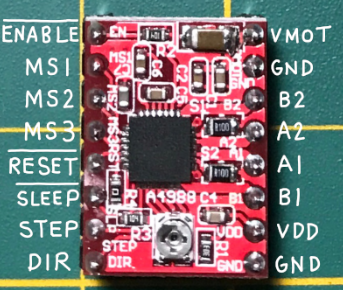
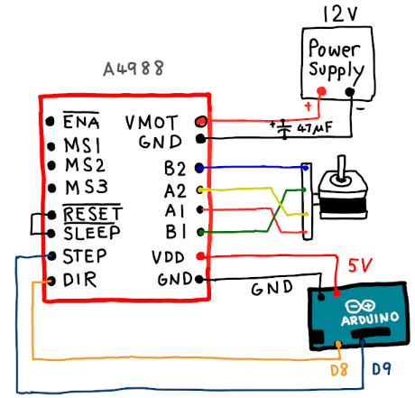
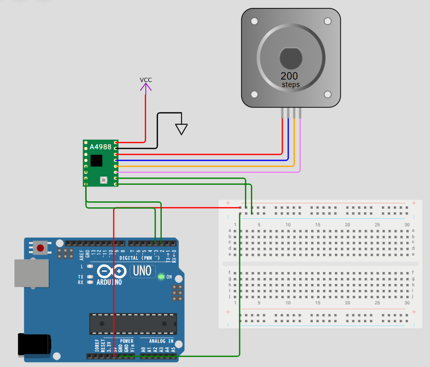

## 目的

モータードライバを使ったモータ動作できないかを確認する。

## Using the A4988 Stepper Driver

A4988をドライバとして使います。

以下がリファレンスです。

ステッピングモータのドライバで、使うにあたり1B/1A/2A/2Bを使います。

[wokwi-a4988 Reference | Wokwi Docs](https://docs.wokwi.com/parts/wokwi-a4988#using-the-a4988-stepper-driver)

Connect the stepper motor pins to the 1B/1A/2A/2B pins of the driver. The RESET pin has to be HIGH, so you can connect it to the adjacent SLEEP pin (which is pulled HIGH by default). Alternatively, you can enable/disable the stepper motor driver from your code by connecting the RESET/SLEEP pins to your microcontroller.

Use the STEP pin to move the stepper motor. Every HIGH pulse on this pin will move the motor one step (or microstep, depending on the MS1/MS2/MS3 pins). When the DIR pin is HIGH, the stepper motor will move clockwise. When the DIR pin is LOW, the motor will move counterclockwise.

For example, if DIR, MS1 and MS3 are LOW, and MS2 is HIGH (1/4 step mode), then pulsing the STEP pin will move the motor 1/4 step (0.45 degrees) counterclockwise.

## Pin names

| Name   | Description                                      | Default * |
| ------ | ------------------------------------------------ | --------- |
| ENABLE | Enable pin, active low (pulled down)             | Low (0)   |
| MS1    | Microstep select pin 1                           | Low (0)   |
| MS2    | Microstep select pin 2                           | Low (0)   |
| MS3    | Microstep select pin 3                           | Low (0)   |
| RESET  | Reset pin, active low (floating)                 |           |
| SLEEP  | Sleep pin, active low (pulled up)                | High (1)  |
| STEP   | Step input, connect to microcontroller           |           |
| DIR    | Direction input: 0=counterclockwise, 1=clockwise |           |
| GND    | Ground                                           |           |
| VDD    | Logic power supply                               |           |
| 1B     | Connect to motor's B-                            |           |
| 1A     | Connect to motor's B+                            |           |
| 2A     | Connect to motor's A+                            |           |
| 2B     | Connect to motor's A-                            |           |
| VMOT   | Motor power supply, not used in the simulation   |           |

## Simulator Examples

* [A4988 control using a button + switch](https://wokwi.com/projects/327823888123691604) - press the green button to move the motor one step, and move the switch to change the direction.
* [4-Motor GCODE controller](https://wokwi.com/projects/327761195587076690) - Type "G00 X10 Y25" to move the first motor 10 steps, and the second one 25 steps.

あった！情報

[Arduino と A4988 でステッピングモーターを制御する方法 - Arduino - 基礎からの IoT 入門](https://iot.keicode.com/arduino/arduino-stepper-motor-a4988.php)



**ENABLE** は LOW にすると出力が有効となり、HIGH にすると出力が無効 (ディスエーブル) になります。

**MS1, MS2, MS3** はステップモードを設定します (下表)。プルダウン抵抗があり、何も接続しないと全て LOW になります。この場合フルステップです。



# 実際に動作

## 必要な部品

* Arduino Uno
* A4988 ステッピングモータドライバ
* ステッピングモータ（例：NEMA17）
* 外部電源（モータに応じた電圧と電流）
* ブレッドボードとジャンパーワイヤー

### ② 配線例（基本）

| A4988 ピン     | 接続先                                             |
| -------------- | -------------------------------------------------- |
| VMOT           | モータ電源 +（例：12V）                            |
| GND (VMOT)     | モータ電源 GND                                     |
| VDD            | Arduino 5V                                         |
| GND            | Arduino GND                                        |
| 1A, 1B, 2A, 2B | ステッピングモータのコイル端子（データシート確認） |
| STEP           | Arduino デジタルピン 3                             |
| DIR            | Arduino デジタルピン 2                             |
| ENABLE         | GND（常に有効）                                    |
| RESET          | 5V（SLEEP と接続して HIGH）                        |
| SLEEP          | 5V                                                 |



ステッピングモータを制御する際に組み合わせるセンサーは、**モータの位置や速度、外部環境を検知する用途**でよく使われます。種類ごとにまとめます。

---

## 1️⃣ 位置・角度検出用センサー

| センサー種類                   | 概要                                           | アプリケーション例                                               |
| ------------------------------ | ---------------------------------------------- | ---------------------------------------------------------------- |
| **ロータリーエンコーダ** | 回転角度や回転方向を検出。光学式・磁気式がある | ロボットアームの関節位置制御、精密テーブルの位置制御             |
| **ポテンショメータ**     | 回転角度を抵抗値で検出                         | サーボ代替や簡易回転角度検出、ボリューム操作                     |
| **ホールセンサー**       | 磁場の変化で回転角を検出                       | ブラシレスDCモータの位置検出、ステッピングモータのホーム位置検出 |

---

## 2️⃣ 速度・回転数検出用センサー

| センサー種類                 | 概要                     | アプリケーション例                  |
| ---------------------------- | ------------------------ | ----------------------------------- |
| **光学エンコーダ**     | 回転速度をパルス数で計測 | 3Dプリンタの送り速度制御、CNC加工機 |
| **タコジェネレーター** | 回転数を電圧に変換       | モータ速度制御、フィードバック制御  |

---

## 3️⃣ 力・トルク検出用センサー

| センサー種類           | 概要                   | アプリケーション例                   |
| ---------------------- | ---------------------- | ------------------------------------ |
| **ロードセル**   | 荷重・トルクを測定     | 自動締め付け機構、押し当て制御       |
| **トルクセンサ** | 軸にかかるトルクを検出 | ロボットアームの安全制御、過負荷検知 |

---

## 4️⃣ 近接・衝突検知用センサー

| センサー種類                     | 概要                   | アプリケーション例                  |
| -------------------------------- | ---------------------- | ----------------------------------- |
| **リミットスイッチ**       | 機械的接触で位置を検出 | ホームポジション設定、CNCの端点検知 |
| **赤外線・超音波センサー** | 距離を検出             | 障害物回避、搬送ラインの物体検知    |
| **光学センサー**           | 物体の有無を検出       | 自動化ラインでの位置決め、素材検出  |

---

## 5️⃣ 応用例（組み合わせ例）

1. **3Dプリンタ**
   * ステッピングモータでエクストルーダやベッドを動かす
   * 光学エンコーダやリミットスイッチで位置確認
   * 温度センサーでヒーター制御
2. **ロボットアーム**
   * 各関節にステッピングモータ
   * ロータリーエンコーダで角度制御
   * 力センサで安全制御
3. **自動搬送装置**
   * ステッピングモータでベルトコンベア駆動
   * 超音波センサーで物体検知
   * リミットスイッチでホーム位置補正
4. **精密位置決め装置（CNC）**
   * ステッピングモータで軸制御
   * 光学エンコーダで高精度フィードバック

---

💡  **ポイント** ：

* ステッピングモータ単体は「ステップ信号の回数」で動作するため、位置検出用センサーと組み合わせると **閉ループ制御** が可能になる
* 力や距離のセンサーと組み合わせると、安全・自動化・精密動作が実現できる

---

希望であれば、Arduino Uno と A4988 で **センサー付きステッピングモータ制御（例：エンコーダ付き）** のサンプル回路とコードも示せます。作りますか？

# センサー検討

PIR（Passive Infrared）モーションセンサーは、**人や動物などの赤外線を放射する対象の動きを検知するセンサー**です。名前の通り「受動型」なので、自分で光を発して照射するわけではなく、環境中の赤外線の変化を感知します。

---

## 1️⃣ 基本構造

* **Pyroelectric センサ素子** ：赤外線を電気信号に変換
* **レンズ（多くはフレネルレンズ）** ：検知範囲を広げたり、感度を調整
* **回路基板** ：信号の増幅・デジタル変換を行う

---

## 2️⃣ 動作原理

1. センサーは周囲の赤外線量（温度）を常時モニタ
2. 人や動物が動くと、センサーが受ける赤外線量が変化
3. 変化が一定閾値を超えると **HIGH/LOW 信号** を出力

* 出力はデジタル信号（Arduino などで直接読み取り可能）
* 静止している物体には反応せず、動いた時のみ反応

---

## 3️⃣ 特徴

* **受動型**なので電力消費が少ない
* 動きを検知するだけで、対象の正確な位置は分からない
* 照明や温度変化などに弱い場合がある（誤検知の可能性）

---

## 4️⃣ Arduino での利用例

* **デジタル入力ピン**に接続して、人が動いたら LED を点灯
* **セキュリティシステム**で侵入検知
* **自動照明制御**

```cpp
int pirPin = 2;  // PIRセンサーの出力ピン
int ledPin = 13; // 内蔵LED

void setup() {
  pinMode(pirPin, INPUT);
  pinMode(ledPin, OUTPUT);
  Serial.begin(9600);
}

void loop() {
  int motion = digitalRead(pirPin);
  if (motion == HIGH) {
    digitalWrite(ledPin, HIGH);
    Serial.println("Motion detected!");
  } else {
    digitalWrite(ledPin, LOW);
  }
}
```

---

💡 **ポイント**

* 「人や動物の動きだけ」を検知するセンサー
* モータや照明などの制御と組み合わせて自動化に使える

---

必要であれば、**PIRセンサーでステッピングモータを動かす例（動くと回転する）** の Arduino サンプルも作れます。作りますか？


## PIRセンサーのサンプル

では、Arduino Uno + A4988 ドライバ + ステッピングモータ + PIR センサーを組み合わせた **「人が動いたらステッピングモータを回す」** サンプルコードを示します。

---

## ⚡ 配線例

* **A4988**
  * VMOT → 外部電源（例: 12V）
  * GND (VMOT側) → 電源 GND
  * VDD → Arduino 5V
  * GND (VDD側) → Arduino GND
  * STEP → Arduino D3
  * DIR → Arduino D4
  * ENABLE (省略可) → GND（常時有効）
  * モータの 4 本線 → A4988 の 1A/1B, 2A/2B に接続
* **PIR センサー**
  * VCC → Arduino 5V
  * GND → Arduino GND
  * OUT → Arduino D2

---

## 📜 サンプルコード

```cpp
#define STEP_PIN 3
#define DIR_PIN 4
#define PIR_PIN 2

void setup() {
  pinMode(STEP_PIN, OUTPUT);
  pinMode(DIR_PIN, OUTPUT);
  pinMode(PIR_PIN, INPUT);

  digitalWrite(DIR_PIN, HIGH); // 回転方向（HIGHでCW, LOWでCCW）
  Serial.begin(9600);
}

void stepMotor(int steps, int delayMicros) {
  for (int i = 0; i < steps; i++) {
    digitalWrite(STEP_PIN, HIGH);
    delayMicroseconds(delayMicros);
    digitalWrite(STEP_PIN, LOW);
    delayMicroseconds(delayMicros);
  }
}

void loop() {
  int motion = digitalRead(PIR_PIN);

  if (motion == HIGH) {
    Serial.println("Motion detected! Rotating motor...");
    stepMotor(200, 800);  // 200ステップ（1回転分: 1.8°/stepモータの場合）、1ステップあたり 800µs
    delay(1000);          // 次の検知まで待機
  }
}
```

---

## 🔧 動作の流れ

1. PIR センサーが動きを検知すると **HIGH** を出力
2. Arduino がその信号を読み取り、`stepMotor()` 関数で指定ステップ回転
3. 動作後 1 秒待機して、次の検知に備える

---

## ✅ 応用ポイント

* `digitalWrite(DIR_PIN, HIGH/LOW)` を切り替えると回転方向を反転可能
* `stepMotor()` 内の **steps** を変えると回転角度を変更できる
* `delayMicroseconds()` を短くするとモータが速く回転

---

👉 ご希望なら、この例を「動作を検知している間ずっとモータを回す」バージョンにもできますが、それも作りますか？
