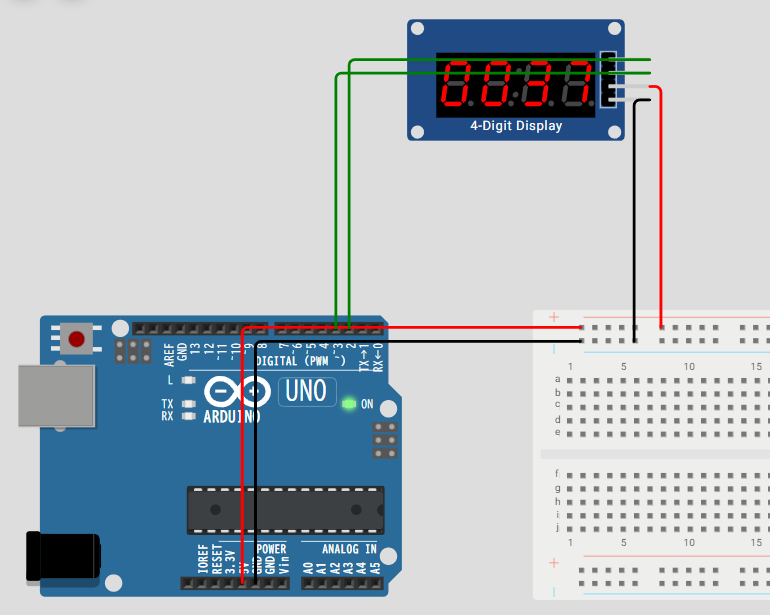

## 目的

デバッグを7segで、センサー＆モータの回路を動作させる。

# 7seg ディスプレイ

ライブラリ間違えてしまう。。。

"TM1637_RT"が正しい。





## 使うセンサー

今回はフォトレジスタセンサにします。

光の強さを検知できます。

[wokwi-photoresistor-sensor Reference | Wokwi Docs](https://docs.wokwi.com/parts/wokwi-photoresistor-sensor)

# ✅ フォトレジスタセンサーとは

**フォトレジスタ（Photoresistor）** は、

**光の強さによって電気抵抗値が変化する素子** です。

* 別名： **CdSセル（硫化カドミウムセル）** , LDR（Light Dependent Resistor）
* **明るいほど抵抗が小さくなり、暗いほど抵抗が大きくなる** 特性を持ちます。
* 単体では「抵抗器」ですが、Arduinoなどのマイコンと組み合わせると **光センサー** として利用できます。

---

# ⚙ 仕組み

* 半導体材料（CdSなど）を使った抵抗素子。
* 光が当たると電子が励起され、電気を流しやすくなる → 抵抗値が下がる。
* 光が弱いと電子が少なく → 抵抗値が上がる。

👉 つまり **光の強さ = 抵抗値の変化** に変換する仕組みです。

---

# 📌 特徴

* **安価で扱いやすい**
* 光に対して反応するが、応答速度は数十ms〜数百ms程度とやや遅い
* 紫外線や赤外線には鈍感（可視光に近い領域で動作）

---

# 🔍 利用例

* 自動点灯の街灯（暗くなるとON）
* スマホの画面の明るさ自動調整
* 簡易的な光センサー（Arduinoロボットのライントレーサーなど）
* セキュリティ装置（レーザー光を遮ったかどうか検知）

---

# 🛠️ Arduinoでの使い方（例）

フォトレジスタを **抵抗と直列に接続して分圧回路** を作り、

その電圧をアナログ入力ピンで読み取ります。

```cpp
int sensorPin = A0;  // フォトレジスタを接続したアナログピン
int sensorValue = 0;

void setup() {
  Serial.begin(9600);
}

void loop() {
  sensorValue = analogRead(sensorPin);  // 0〜1023の値を取得
  Serial.println(sensorValue);
  delay(500);
}
```

---

# 🧠 まとめ

* フォトレジスタ = **光の強さで抵抗値が変わる素子**
* 明るい → 抵抗小、暗い → 抵抗大
* 安価・簡単に光センサーを作れるが、応答速度は遅め
* Arduinoなどと組み合わせると「明るさセンサー」として活躍

---

👉 よく似た光センサーに **フォトダイオード** や **フォトトランジスタ** もあります。

もしよければ、それらと **フォトレジスタの違い** も表でまとめましょうか？
