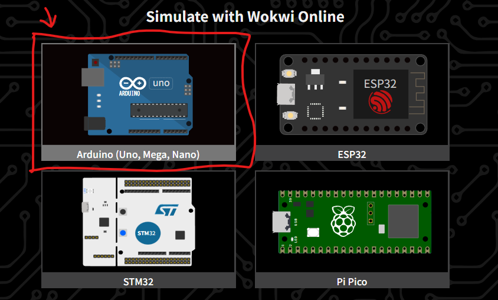
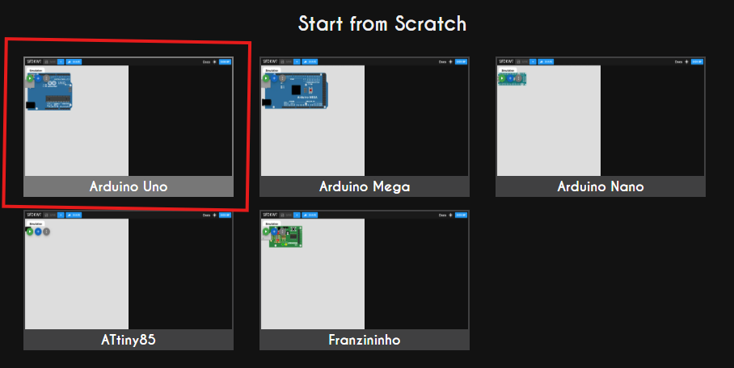
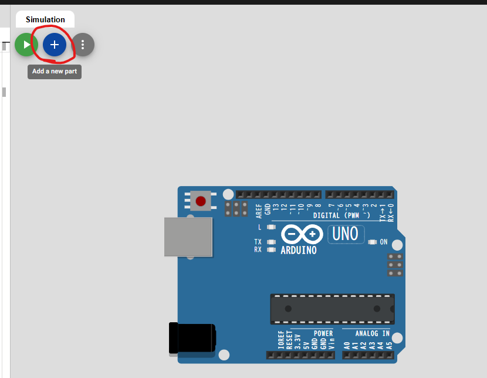
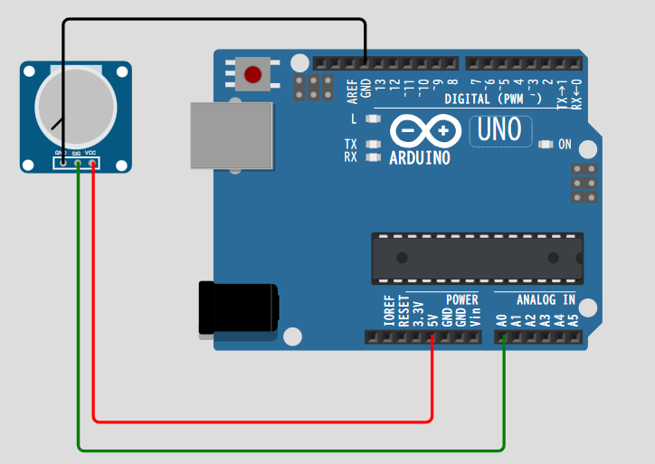
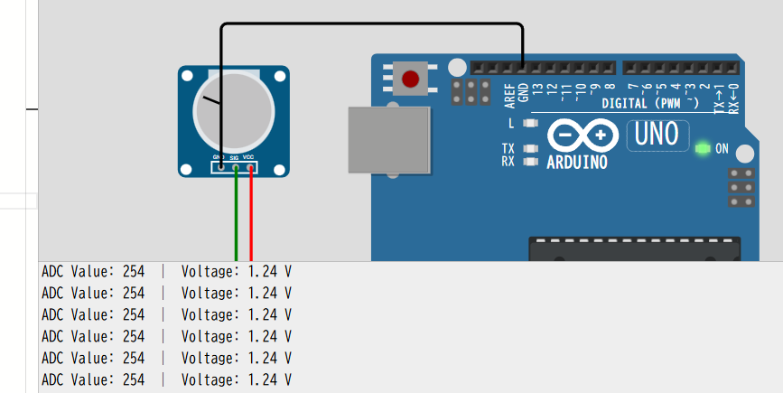

[先日のADC](https://yoshishinnze.hatenablog.com/entry/2026/11/16/043000)を実際に体感してみたいということで仮想環境の[Wokwi](https://wokwi.com/)を用いて例題を行ってみようと思います。

## 例題1
Wokwiで試せるADCの簡単な例題を2つ用意しました。**ポテンショメータ（可変抵抗）** でADCの基本を体感する例と、**温度センサ**で実用的な計測を体験する例です。

### 問題：ポテンショメータで電圧を読む

回転ノブを動かすと電圧が変わり、ADC値（0〜1023）が変化します。ADCの分解能を視覚的に理解できます。

__使用部品__
- Arduino Uno × 1
- Potentiometer（ポテンショメータ / 可変抵抗）× 1

__配線方法__

```
ポテンショメータ
├─ 左端子 ───→ Arduino 5V
├─ 中央端子 ──→ Arduino A0（ADC入力）
└─ 右端子 ───→ Arduino GND
```

Wokwi上では、部品パレットから「Potentiometer」を選んでドラッグ&ドロップし、上記の通り配線してください。

__Arduinoコード__

```cpp
void setup() {
  Serial.begin(9600);
}

void loop() {
  int adcValue = analogRead(A0);           // 10ビットADCで読む（0〜1023）
  float voltage = adcValue * (5.0 / 1023.0); // 電圧に変換（5V基準）

  Serial.print("ADC Value: ");
  Serial.print(adcValue);
  Serial.print("  |  Voltage: ");
  Serial.print(voltage);
  Serial.println(" V");

  delay(500);
}
```

コードの解説はこんな感じです。

プログラムは大きく分けて、最初に1度だけ実行される `setup()` 関数と、電源が入っている間ずっと繰り返される `loop()` 関数の2つで構成されています。

__1. 初期設定 (`setup` 関数)__

* `Serial.begin(9600);`
* パソコンとマイコンの間で通信を行うための**シリアル通信を開始**します。通信速度（ボーレート）は `9600 bps` に設定されています。これにより、マイコン内部のデータをパソコンの「シリアルモニター」画面で確認できるようになります。


__2. メインループ (`loop` 関数)__

* `int adcValue = analogRead(A0);`
* アナログ入力ピン `A0` にかかっている電圧を読み取ります。一般的なArduino（Unoなど）のADC（アナログ・デジタル変換器）は10ビットの精度を持つため、**0 から 1023 まで**のデジタル値に変換されて `adcValue` に格納されます（例：0Vなら0、5Vなら1023付近）。


* `float voltage = adcValue * (5.0/1023.0);`
* 読み取った0〜1023の数値を、実際の**電圧値（ボルト）に変換**する計算です。基準電圧を 5.0V と仮定し、比例計算によって「何ボルトか」を浮動小数点（`float`）で求めます。


* `Serial.print(...)` / `Serial.println(...)`
* 読み取った元のADC値と、計算した電圧値を組み合わせ、次のような形式でシリアルモニターに出力します。
* 出力例：`ADC Value: 512  |  Voltage: 2.50 V`

* `delay(500);`
* 処理の間に **0.5秒（500ミリ秒）の待機時間** を入れます。これにより、データが流れる速度が人間が読み取りやすい適度な速さに調整されます。


__試し方__
1. [Wokwi](https://wokwi.com/) で新規プロジェクトを作成（Arduino Unoを選択）





2. 部品パレットから「Potentiometer」を追加



ポテンショメータには3本の端子があります。こんな感じで左から順に配線します。

```
ポテンショメータの左端子  ──→  Arduino 5V
ポテンショメータの中央端子 ──→  Arduino A0
ポテンショメータの右端子  ──→  Arduino GND
```



3. 上記コードを `sketch.ino` に貼り付け
4. シミュレーションを開始（▶ボタン）
5. **ポテンショメータのノブをドラッグして回転**させると、シリアルモニタの値が0〜1023の間で変化します



__確認ポイント__
- ノブを最小にすると `ADC Value: 0` / `Voltage: 0.00 V`
- ノブを最大にすると `ADC Value: 1023` / `Voltage: 5.00 V`
- 真ん中だと `ADC Value: 約512` / `Voltage: 約2.50 V`

これで、ポテンショメータがアナログ信号を出力し、マイコンでDC変換を行うという、 **連続的な電圧が1024段階の数字に区切られている** というADCの性質が体感できます。


## 例題2

### 問題：TMP36温度センサで温度を測る

ADCの値から実際の物理量（温度）を計算する例です。

__使用部品__
- Arduino Uno × 1
- TMP36温度センサ × 1

__配線方法__

```
TMP36
├─ 左端子（+Vs）─→ Arduino 5V
├─ 中央端子（Vout）→ Arduino A0
└─ 右端子（GND）──→ Arduino GND
```

__Arduinoコード__

```cpp
void setup() {
  Serial.begin(9600);
}

void loop() {
  int adcValue = analogRead(A0);
  float voltage = adcValue * (5.0 / 1023.0);  // 電圧に変換
  float temperature = (voltage - 0.5) * 100;   // TMP36の公式: 0.5Vオフセット、10mV/°C

  Serial.print("ADC: ");
  Serial.print(adcValue);
  Serial.print(" | Voltage: ");
  Serial.print(voltage);
  Serial.print(" V | Temperature: ");
  Serial.print(temperature);
  Serial.println(" C");

  delay(500);
}
```

__試し方__
1. Wokwiで新規プロジェクトを作成
2. 部品パレットから「TMP36」を追加（検索欄に「TMP36」と入力）
3. 上記コードを貼り付け
4. **TMP36部品をクリックすると「温度」スライダーが出現**します
5. スライダーを動かすと、設定温度が変わり、ADC値と計算された温度がシリアルモニタに表示されます

__確認ポイント__
- TMP36は **10mV/°C** の傾きで電圧を出力し、 **0°Cで0.5V** を出力します
- ADC値 → 電圧 → 温度という**2段階の変換**がセンシングの基本パターンです


## まとめ

| 例題 | 学べること | 難易度 |
|------|-----------|--------|
| **ポテンショメータ** | ADCの分解能（0〜1023）、電圧との対応 | 初級 |
| **TMP36温度センサ** | ADC値 → 物理量への換算、センサの特性式 | 中級 |

まずは**ポテンショメータの例**から始めて、ノブを回してADC値がどう変わるか体感してみてください。次にTMP36で「数字が温度という意味を持つ」段階まで進めると、センシングの全体像が掴めます。