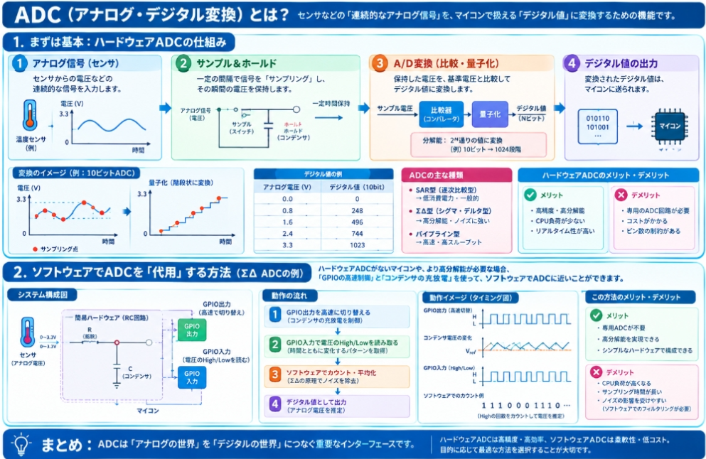

## ADCとは
ADC（Analog-to-Digital Converter / アナログ・デジタル変換器）とは、**センサが出す「連続的な電圧信号」を、マイコンが理解できる「0と1の数字」に変換する装置**です。

### 1. 基本概念

センサ（温度センサや光センサなど）は、測った物理量を「電圧の大きさ」として出力します。しかしマイコン（ArduinoやESP32など）は、電圧そのものではなく「数字」しか扱えません。ADCはその橋渡しをする部品です。

### 2. 直感的なアナロジー：目盛りのないものを目盛りで測る

温度を測るとします。

- **アナログ信号**: 「今、ちょうど26.3度…いや、26.35度…」と**滑らかに変化する**連続的な値
- **デジタル値**: 「26度」と**決まった刻みで区切った**離散的な値

ADCは、滑らかな温度変化を「どの目盛りの区間に入るか」で数字に変換する、いわば**目盛り付きの定規**のようなものです。
ただし、目盛りが細かければ細かいほど正確に測れますが、目盛りが粗いと「26.3度」と「26.7度」が同じ「26度」として記録されてしまいます。

### 3. メカニズム：ADCはどうやって変換するのか

ADCにはいくつかの方式がありますが、最も一般的な**逐次比較型**の考え方を簡単に説明します。

__例：3ビットADCで電圧を測る__

3ビットのADCは、電圧を **2^3 = 8段階**（0〜7の数字）で表します。

| 入力電圧範囲 (0〜5Vを8分割) | デジタル出力 |
|---------------------------|------------|
| 0.00V 〜 0.625V | 000 (0) |
| 0.625V 〜 1.25V | 001 (1) |
| 1.25V 〜 1.875V | 010 (2) |
| ... | ... |
| 4.375V 〜 5.00V | 111 (7) |

**1段階（1 LSB）の幅 = 5V / 8 = 0.625V**

つまり、入力電圧が1.5Vだったら、出力は「010（2）」になります。0.1Vの変化は検出できません。

__分解能（ビット数）が重要__

実際のマイコンでは、もっとビット数が多いです。

| ビット数 | 段階数 | 5V範囲での1段階の幅 |
|---------|--------|-------------------|
| 8ビット | 256段階 | 約 19.5 mV |
| 10ビット | 1024段階 | 約 4.9 mV |
| 12ビット | 4096段階 | 約 1.2 mV |
| 16ビット | 65536段階 | 約 0.076 mV |

Arduino UnoのADCは**10ビット**なので、0〜5Vを1024段階で測ります。1段階約4.9mVの精度です。

### 4. ADCの重要なパラメータ

__分解能（Resolution）__

何ビットで測るか。ビット数が多いほど細かい変化を捉えられる。

__変換速度（Sampling Rate）__

1秒間に何回変換できるか。音を測る場合は高速（数万〜数十万回/秒）が必要。温度測定なら低速でも十分。

__入力電圧範囲__

通常 0〜3.3V または 0〜5V。この範囲外の電圧を入れると壊れる。

__量子化誤差__

連続的な値を離散的な段階に丸めることで生じる誤差。最大で ±0.5 LSB（1段階の半分）。

### 5. センサとの関係でよくある混同

__ADC vs センサ__
- **センサ**: 温度・光・距離などの物理量 → 電圧に変換
- **ADC**: 電圧 → 数字に変換

センサとADCは別物です。マイコン内部にADCが内蔵されていることが多いので、気づかないうちに使っていることがあります。

__ADC vs DAC__
- **ADC（Analog → Digital）**: アナログをデジタルに変換（測る側）
- **DAC（Digital → Analog）**: デジタルをアナログに変換（出力側、例：音を鳴らす）

### 6. 実際のコード例（Arduino）

```cpp
int value = analogRead(A0);  // A0ピンの電圧を10ビットADCで読む
// 返り値は 0〜1023
// 0 = 0V, 1023 = 5V（Arduino Unoの場合）
```

この `analogRead()` の裏側で、ADCが電圧を数字に変換しています。

## ADCの仕組み

ADCは**基本的にハードウェア**です。ただし、ソフトウェアでADCの一部機能を代替することも可能で、実際にそういう手法も存在します。両者の違いを整理します。

### 1. 通常のADCはハードウェア

マイコンに内蔵されているADC（Arduinoの `analogRead()` が使うものなど）は、**シリコン上に実際の物理回路として存在**します。

__なぜハードウェアなのか__

ADCの変換には、以下のような物理的な動作が必要です。

- **サンプル&ホールド回路**: 入力電圧を一瞬「取り込んで保持」する
- **コンパレータ**: 2つの電圧を比較してどちらが大きいか判定する
- **DAC（内部参照用）**: 比較の基準となる電圧を生成する
- **逐次比較レジスタ**: ビットごとに「この電圧より大きい？小さい？」を判定していく

これらはすべて**トランジスタ・コンデンサ・抵抗**などの物理部品で構成されたアナログ回路です。ソフトウェアだけでは電圧を直接測れません。

### 2. ソフトウェアでADCを「代用」する方法もある

ハードウェアADCがないマイコンや、より高分解能が必要な場合、**ソフトウェア＋簡易ハードウェア**でADCに近いことができます。

__例：ΣΔ（シグマ・デルタ）ADCをソフトウェアで実現__



この方式では、GPIOピンを高速に切り替えながらコンデンサの充放電を制御し、ソフトウェアでそのパターンを解析して電圧を推定します。

__ソフトウェアADCのメリット・デメリット__

| | ハードウェアADC | ソフトウェアADC |
|---|---|---|
| **精度** | 高い（設計された回路なので安定） | 低〜中（GPIOの速度・ノイズに依存） |
| **速度** | 速い（µsオーダー） | 遅い（ms〜sオーダー） |
| **分解能** | 固定（10ビット、12ビットなど） | 調整可能（平均化回数で変えられる） |
| **CPU負荷** | ほぼなし（変換中もCPUは別の処理ができる） | 高い（GPIO操作と計算を繰り返す） |
| **部品数** | 内蔵なら0、外部ICなら1個 | 外部に抵抗・コンデンサが必要 |

### 3. 実際の使い分け

__ハードウェアADCを使う場面（ほとんどの場合）__
- Arduinoで温度センサを読む
- ESP32でジョイスティックの電圧を読む
- マイコン内蔵ADCで十分な精度・速度が出る場合

__ソフトウェアADCを使う場面（特殊な場合）__
- **GPIOが余っていてADC専用ピンがない**安価なマイコン（PICやAVRの一部）
- **超高分解能**（20ビット以上）が必要で、高価な外部ADC ICを避けたい場合
- **複数チャンネルを同時に測りたい**が、内蔵ADCのチャンネル数が足りない場合

## ADCを実装したもの

ADCを実行できる基盤（ハードウェアプラットフォーム）は、用途や必要な精度・速度によって大きく分けて以下のカテゴリがあります。

### 1. マイコンボード（内蔵ADC付き）

最も身近で手軽な基盤です。ほとんどの現代マイコンにはADCが内蔵されています。

| 基盤 | MCU | ADC仕様 | 特徴 |
|------|-----|---------|------|
| **Arduino Uno** | ATmega328P | 10ビット、6ch、約0.1ms/変換 | 初心者向け。`analogRead()`で即座に使える |
| **Arduino Mega** | ATmega2560 | 10ビット、16ch | チャンネル数が多い |
| **Raspberry Pi Pico** | RP2040 | 12ビット、4ch、500ksps | 高速。MicroPython/Cで使える |
| **ESP32** | ESP32 | 12ビット、18ch、2Msps | WiFi/Bluetooth搭載。IoT向き |
| **ESP32-S2/S3** | ESP32-S2/S3 | 12ビット、20ch | より高速・高精度なモデルも |
| **STM32 Nucleo** | STM32F4/F7等 | 12〜16ビット、複数ch、高速 | 産業用レベルの性能。HALライブラリ使用 |
| **Teensy 4.1** | ARM Cortex-M7 | 12ビット、高速変換 | オーディオ処理等、高速ADCが必要な場合 |
| **Adafruit Feather** | 各種 | 搭載MCU依存 | 小型・無線機能付き。 wearable 向き |

**ロボット制御・センシング学習には、Raspberry Pi PicoやESP32がコストパフォーマンス良くおすすめ**です。

### 2. シングルボードコンピュータ（SBC）＋外部ADC

SBC自体にはGPIOに内蔵ADCがない（あるいは限定的な）ものが多いため、外部ADC ICを使います。

| 基盤 | 対応外部ADC | 用途 |
|------|------------|------|
| **Raspberry Pi** | ADS1115（I2C）、MCP3008（SPI）、ADC HAT | 画像処理＋センサ入力。AIロボット等 |
| **BeagleBone Black** | 内蔵ADC（7ch、12ビット）あり | Linux上でリアルタイムADCが可能 |
| **NVIDIA Jetson** | 外部ADC IC、またはUSB-DAQ | AI推論＋センサ融合 |

### 3. 外部ADC IC（ブレイクアウトボード）

マイコンの内蔵ADCでは精度や速度が足りない場合に使います。I2CやSPIで接続します。

| IC/モジュール | 分解能 | インターフェース | 主な用途 |
|--------------|--------|---------------|---------|
| **ADS1115** | 16ビット | I2C | 精密電圧測定。温度・光センサ等 |
| **ADS1015** | 12ビット | I2C | ADS1115の低分解能版。安価 |
| **MCP3008** | 10ビット | SPI | 8チャンネル。Raspberry Piと組み合わせて定番 |
| **HX711** | 24ビット | 専用シリアル | **ロードセル（重さ測定）専用**。高分解能 |
| **AD7606** | 16ビット | 並列/SPI | 8チャンネル同時サンプリング。電力計測等 |
| **NAU7802** | 24ビット | I2C | ロードセル・精密計量向け |

### 4. データアクイジション（DAQ）デバイス

産業用・計測用の基盤です。高価ですが高精度・多チャンネル・高速度です。

| メーカー・製品 | 特徴 |
|--------------|------|
| **NI（National Instruments）myDAQ / USB-6001** | LabVIEW連携。教育向け。14ビット、200ksps |
| **NI USB-4431** | 24ビット、高精度音響・振動計測 |
| **Keysight U2331A** | USB接続、64Msps、産業用DAQ |
| **Digilent Analog Discovery** | 学生向け。オシロスコープ＋波形ジェネレータ＋電源＋DAQの統合 |

**大学の実験や産業現場のプロトタイピング**でよく使われます。

### 5. FPGAベース

超高速・並列処理が必要な場合に使います。ソフトウェアADCも実装可能です。

| 基盤 | 特徴 |
|------|------|
| **Xilinx Zynq（PYNQ等）** | ARM + FPGA。高速ADCと連携可能 |
| **Terasic DE10-Nano** | FPGAボード。外部ADCモジュール接続可能 |
| **Red Pitaya** | オシロスコープ/DAQとして使える。125Msps、14ビット |

**ソフトウェア無線（SDR）・高速制御・リアルタイム信号処理**などに使われます。

### 6. オシロスコープ・計測器（ADCを内内蔵した観測基盤）

厳密には「基盤」ではなく計測器ですが、内部に超高速ADCを搭載しています。

| 機器 | ADC性能 | 用途 |
|------|---------|------|
| **デジタルオシロスコープ** | 1Gsps〜（8〜12ビット） | 波形観測。ADCの動作確認に |
| **ロジックアナライザ** | デジタル信号専用 | UART/SPI/I2Cのデジタル波形解析 |
| **USBオシロスコープ**（Hantek等） | 20〜100Msps | 安価。個人での信号確認に |

### 7. ソフトウェアADC基盤（特殊なアプローチ）

ハードウェアADCを使わず、GPIO＋外部回路＋ソフトウェアでADCを実現する方法です。

```
[センサ電圧] ──→ [RC回路] ──→ [GPIO入力] ──→ [ソフトウェアで充放電時間を計測]
```

| 基盤 | 方法 |
|------|------|
| **Raspberry Pi（GPIOのみ）** | RC充放電時間を測って電圧推定。精度は低い |
| **安価なPIC/AVR** | コンパレータ内蔵ピンを使ったΣΔ変換のソフト実装 |

**「ADCピンがない」「もう1チャンネル必要」という場合の救済策**として存在します。

## GPIOピン

GPIOピン（General Purpose Input/Output Pin / 汎用入出力ピン）とは、**マイコンが「外の世界」と情報をやり取りするための汎用的な端子**です。

### 1. 基本概念

GPIOピンは、マイコンにとっての**手と目と口**のようなものです。

- **入力（Input）**: 外からの信号を「読む」（目・耳）
- **出力（Output）**: 外に信号を「送る」（手・口）

1本のピンが「読むモード」と「送るモード」を切り替えて使えます。

### 2. 直感的なアナロジー：部屋の電気スイッチとコンセント

GPIOピンを「部屋の壁にある端子」だと想像してください。

- **出力モード**: スイッチをONにすると電気が流れて、LEDが光る（部屋の照明をつける）
- **入力モード**: ドアベルのボタンが押されたかを確認する（外からの信号を読む）

1つの端子が「電気を出す側」にも「電気を受け取る側」にもなれるのがGPIOの汎用性です。

### 3. GPIOピンが存在する理由

マイコン（ArduinoやESP32、Picoなど）は、内部では0と1のデジタル世界を生きています。しかし、外の世界は**電圧の高低**や**アナログ信号**として存在します。GPIOはその**境界の翻訳窓口**です。

__GPIOでできること__

| モード | 具体的な使い方 |
|--------|--------------|
| **デジタル出力** | LEDを点滅させる、リレーを駆動する、モーターを回す |
| **デジタル入力** | ボタンのON/OFFを読む、人感センサの信号を受ける |
| **アナログ入力** | 温度センサや光センサの電圧値を読む（ADC機能付きピン） |
| **PWM出力** | LEDの明るさ調整、モーターの速度制御（擬似的なアナログ出力） |
| **通信プロトコル** | UART・I2C・SPIで他のデバイスと通信する |

### 4. GPIOピンの種類

マイコンボードのピンは、すべてが「自由に使えるGPIO」ではありません。役割が決まっているものもあります。

__主な種類__

| ピンの種類 | 説明 |
|-----------|------|
| **GPIO（汎用）** | 自由に入出力をプログラムで設定できる |
| **GND** | グラウンド（基準電位、0V）。必ず必要 |
| **VCC / 3.3V / 5V** | 電源ピン。外部回路やセンサに電力を供給 |
| **ADC専用ピン** | アナログ電圧を読む専用（ArduinoのA0〜A5など） |
| **特殊機能ピン** | 通信（TX/RX, SDA/SCL）、リセット、ブートモード切替など |

__注意点：電圧レベル__

- **5V系**（Arduino Uno等）: HIGH = 5V、LOW = 0V
- **3.3V系**（ESP32、Pico等）: HIGH = 3.3V、LOW = 0V

**3.3Vのマイコンに5Vを直接入れると壊れることがあります**。レベル変換回路が必要な場合があります。

### 5. コードでのイメージ（Arduino）

```cpp
pinMode(13, OUTPUT);  // 13番ピンを「出力モード」に設定
digitalWrite(13, HIGH);  // 13番ピンに5Vを出力 → LEDが光る

pinMode(2, INPUT);  // 2番ピンを「入力モード」に設定
int buttonState = digitalRead(2);  // 2番ピンの状態を読む（HIGH or LOW）

int sensorValue = analogRead(A0);  // A0ピンのアナログ電圧をADC変換して読む
```

## 総括

ADCの本質を簡潔にまとめると、以下の3点です。

### ADCの本質

__1. ADCとは何か__
**「連続的な電圧」を「離散的な数字」に変換する装置。** センサが測った物理量（温度・光・距離など）は電圧として現れますが、マイコンは電圧そのものではなく数字しか扱えません。ADCはその橋渡しをします。

__2. ADCはハードウェアである__
マイコン内部に**物理的な回路（コンパレータ・コンデンサ・トランジスタ）** として存在します。ソフトウェアだけでは電圧を直接測れません。Arduinoの `analogRead()` の裏側で、このハードウェア回路が動いています。

__3. ADCの性能は「分解能」と「速度」で決まる__
- **分解能（ビット数）**: 電圧を何段階に切り分けるか。Arduino Unoは10ビット（1024段階）、ESP32/Picoは12ビット（4096段階）。
- **変換速度**: 1秒間に何回測れるか。音響計測なら高速が必要、温度計測なら低速で十分。

### 補足：GPIOとの関係

ADCはマイコンの**ADC専用ピン**（ArduinoではA0〜A5など）を通じて外部の電圧を読みます。GPIOはマイコンが外界と接続する汎用端子で、その一部のピンがADC機能を兼ね備えています。

### 一言で言えば

> **ADCは、センサの「電圧の言葉」をマイコンの「数字の言葉」に翻訳する、マイコン内蔵のハードウェア回路です。**

